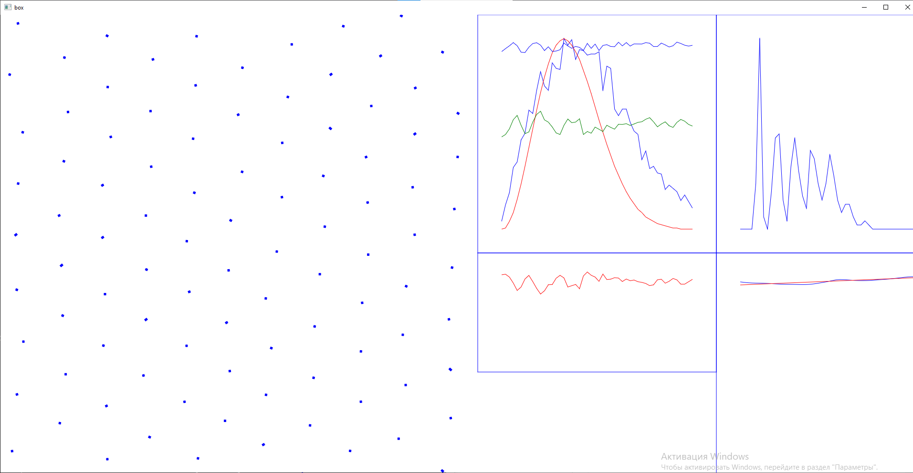

# box
## Building for Windows
```bash
make
```

## Layout
```
+---------------------+----------+----------+
|                     |          |          |
|                     | Velocity |   RDF    |
|                     |          |          |
|    visual 2D        +----------+----------+
|                     |          |          |
|                     |  Energy  |   MSD    |
|                     |          |          |
+---------------------+----------+----------+
```

## Running

```bash
./main n100 f-30 w10 r2.3 d0.001
```

